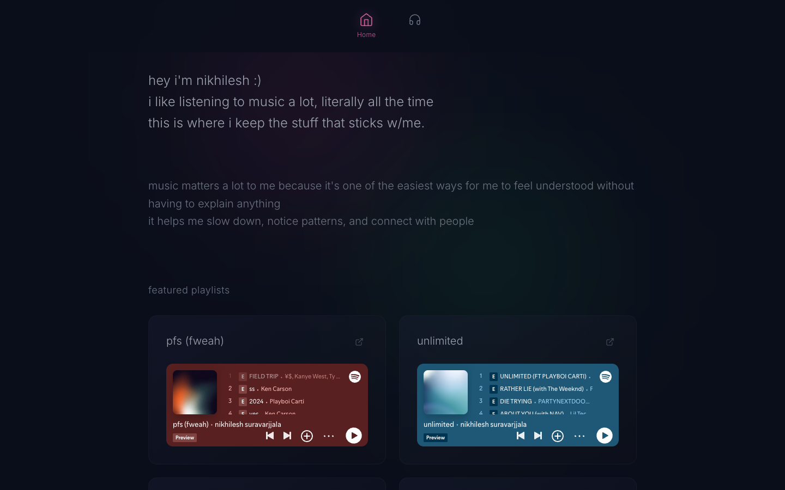

<p align="center">
  
</p>

# Nikhilesh Music

A personal music site that turns my Spotify playlists into a quiet, browsable diary.

**Live:** <https://nikhilesh-music.vercel.app>

## Why

I listen to music almost all the time, and it's one of the easiest ways for me to feel understood without having to explain anything. This site is where I keep the playlists that stuck with me, grouped and featured my way.

## What it does

- A home page with a short intro and hand-picked featured playlists.
- A playlists page with category filters, built on Spotify embeds so every playlist is playable in place.
- A daily GitHub Action that pulls my public playlists from the Spotify API and commits the updated data, which triggers a redeploy.
- Only public playlists owned by my account are published; followed and private playlists are dropped at sync time.

## Design

It should feel like a dark room at night: deep navy, soft grey type, and pink and green glows drifting slowly behind everything. All copy is lowercase and set in one light weight.

| | |
|---|---|
| Type | Inter 300 only, lowercase throughout |
| Color | `#0a0e1a` background · `#9ca3af` text · `#f472b6` pink (home, active) · `#4ade80` green (playlists, hover) |
| Motion | CSS keyframes only: 0.6 s `cubic-bezier(0.22, 1, 0.36, 1)` staggered card entrance, 18 s / 26 s background drift, all disabled under reduced motion |

## How it works

A Node script authenticates with the Spotify Web API using a stored refresh token and writes `src/data/playlists.generated.json`. Manual curation (categories, featured slots, embed heights) lives separately in `src/data/playlistMeta.json`, so a sync never overwrites my edits. The React app reads both at build time and is hosted on Vercel.

**Stack:** React 18 · TypeScript · Vite · Tailwind CSS · Spotify Web API · GitHub Actions

## Run locally

```bash
npm install
npm run dev
```

The site builds from the committed playlist data, so Spotify credentials are only needed to refresh it.

### Spotify setup

1. Create a Spotify app at `https://developer.spotify.com/dashboard`.
2. Add `http://127.0.0.1:8888/callback` as a Redirect URI in the Spotify app settings.
3. Copy `.env.example` to `.env`.
4. Fill in `SPOTIFY_CLIENT_ID` and `SPOTIFY_CLIENT_SECRET`.
5. Generate the auth URL:

```bash
npm run spotify:auth:url
```

6. Open the printed URL, approve access, and copy the `code` value from the redirect URL.
7. Exchange the code for a refresh token and save it to `.env`:

```bash
npm run spotify:auth:exchange -- --code=PASTE_CODE_HERE --save
```

8. Pull your playlists from Spotify:

```bash
npm run spotify:sync
```

### Ongoing updates

If your site redeploys on every push, the included GitHub Actions workflow can keep playlist data current automatically.

Add these GitHub repository secrets:

- `SPOTIFY_CLIENT_ID`
- `SPOTIFY_CLIENT_SECRET`
- `SPOTIFY_REFRESH_TOKEN`

Then enable GitHub Actions. The workflow runs daily and can also be triggered manually.

### Manual curation

- Edit `src/data/playlistMeta.json` to set categories, homepage featured playlists, and embed heights.
- Only public playlists owned by the Spotify user IDs in `src/data/owners.json` are published. Followed playlists from other accounts are dropped at sync time.
- Public playlists from Spotify will appear automatically as `uncategorized` unless you tag them in that file.
- Private playlists are never published to the site even if they exist in synced Spotify data.
- `showOnPlaylistsPage: false` keeps a playlist available for featured sections without listing it on the main playlists page.
